# Material3.WinForms

[](https://www.nuget.org/packages/Material3.WinForms)
[](https://github.com/dary1337/material3-winforms/releases/latest/download/Material3.Gallery.exe)
[](https://github.com/dary1337/material3-winforms)

**Material 3 (Material You) for Windows Forms** — drop-in design tokens and owner-drawn controls.
Dynamic color from a single seed, runtime light/dark switching, the full M3 type scale, elevation,
state layers and motion. No mandatory base form, no native dependencies.

<p align="center">
  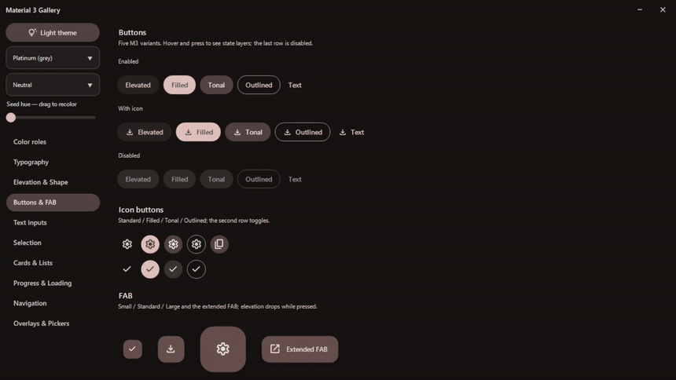
</p>
<p align="center"><sub>Drag the seed hue — the entire palette recolors live through the HCT pipeline.</sub></p>

Existing "Material for WinForms" libraries implement Material **2** and are largely unmaintained.
This project targets the current spec: HCT tonal palettes, color roles, surface containers and
the 2023+ component look.

> Status: **preview (0.5)**. Foundation and the core component catalog are complete.

## Screenshots

The same gallery pages in **light and dark** — every control follows the active scheme.
Rows: color roles · buttons & FAB · selection · cards & lists · overlays & pickers.

| Light | Dark |
|:---:|:---:|
| 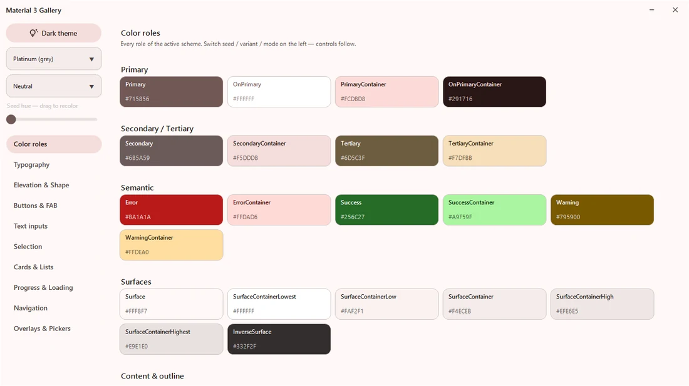 | 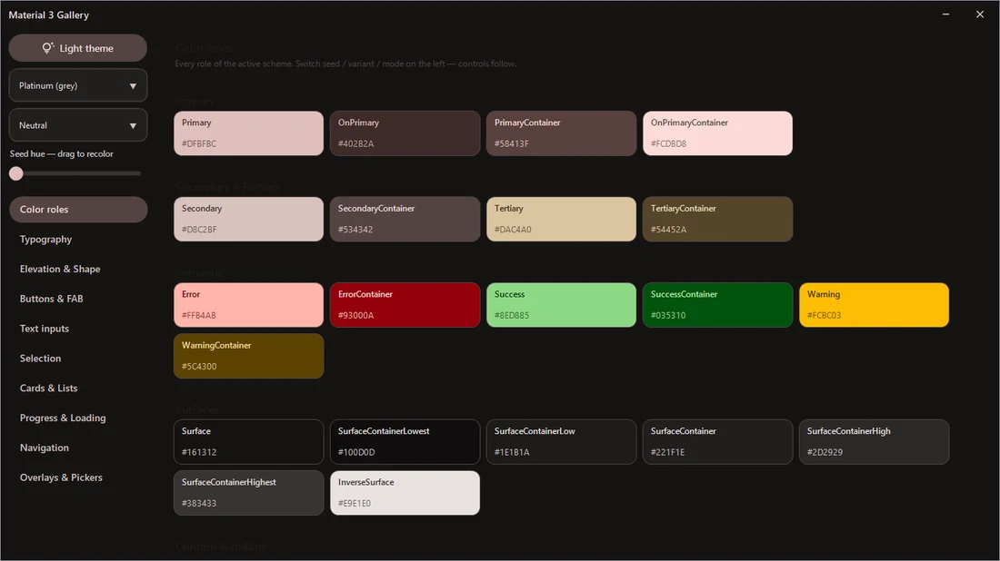 |
| 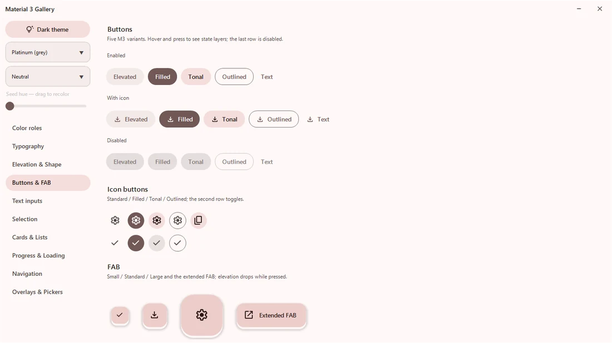 | 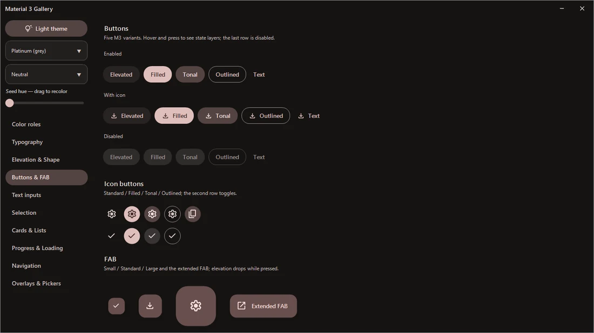 |
| 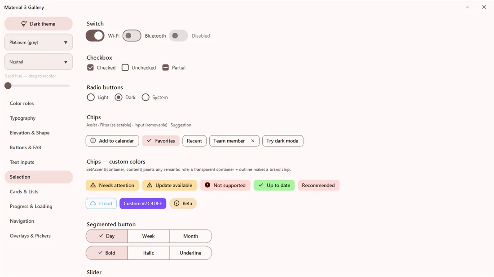 | 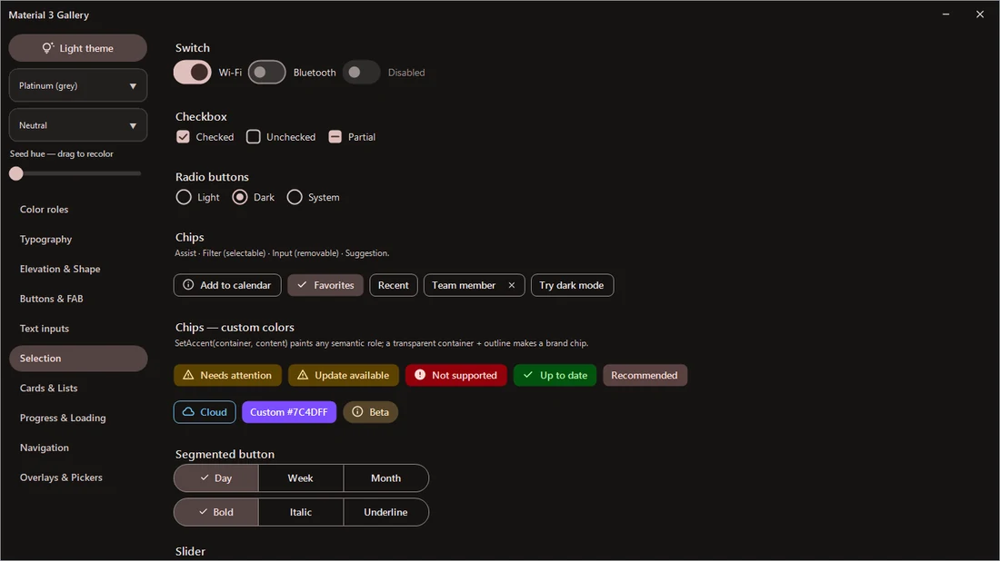 |
| 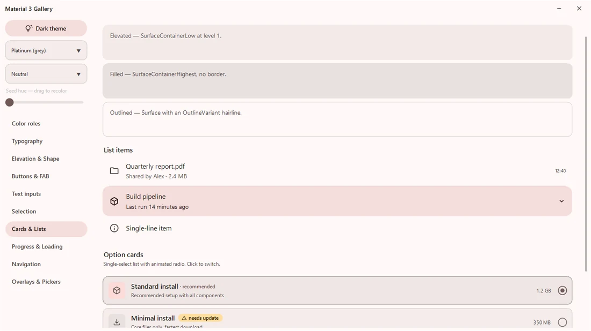 | 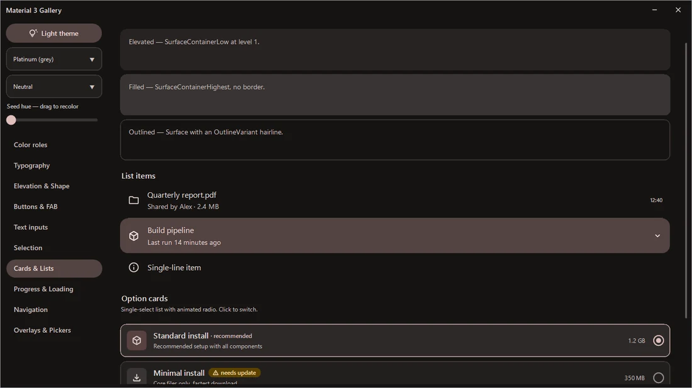 |
| 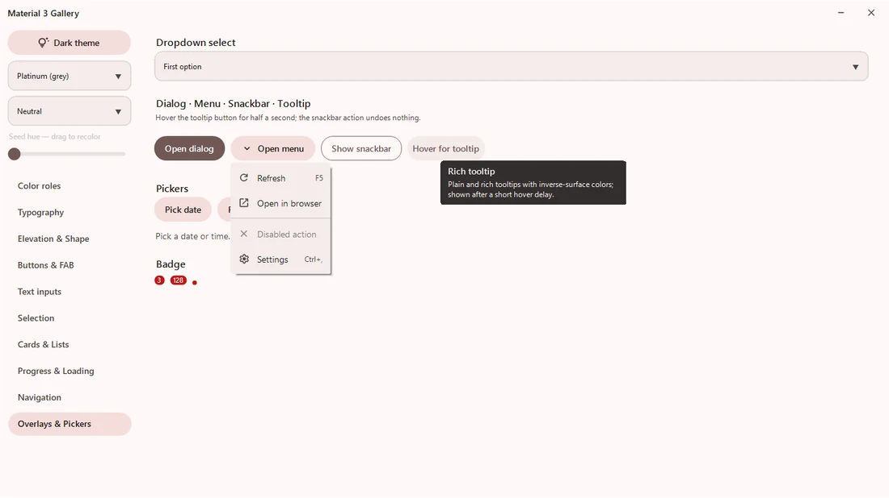 | 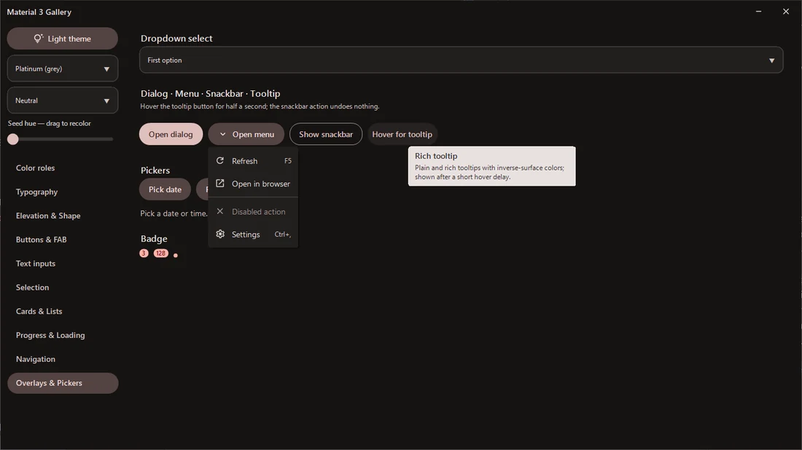 |

<sub>Screenshots and demos captured on **v0.5** with the *Platinum* seed.</sub>

## Features

- **Dynamic color** — full light + dark `ColorScheme` generated from one seed color through a
  C# port of the HCT/CAM16 pipeline (no native dependencies). Three variants: `TonalSpot`
  (M3 default), `Neutral` (near-monochrome), `Vibrant`.
- **Runtime theme switching** — `ThemeManager.IsDark = false` repaints every subscribed control;
  no restart, no per-control wiring.
- **Color roles** — all M3 roles including the six surface containers, inverse roles, outline
  pair, plus shared `Success`/`Warning` extensions.
- **Type scale** — all 15 styles (Display → Label) on Segoe UI with letter-spacing and
  line-height metadata GDI fonts can't carry.
- **Elevation 0–5** — painted soft shadows (WinForms has no compositor) + per-level surface tint.
- **State layers** — spec opacities for hover / focus / pressed / dragged, used consistently by
  every control.
- **Motion tokens** — M3 duration scale and cubic-bezier easings (standard + emphasized)
  evaluated exactly like CSS timing functions.
- **Material Symbols** — 30+ icons embedded as SVG, rasterized with caching and tinted to any
  role color.

## Controls

| Family | Included |
|---|---|
| Actions | `MaterialButton` (5 variants), `MaterialIconButton` (4 styles + toggle), `MaterialFab` (small / standard / large / extended), `MaterialSegmentedButton` |
| Text inputs | `MaterialTextField` (filled + outlined, floating label, error state, icons), `MaterialSearchBar` |
| Selection | `MaterialSwitch`, `MaterialCheckBox` (incl. indeterminate), `MaterialRadioButton`, `MaterialChip` (assist / filter / input / suggestion), `MaterialSlider`, `MaterialOptionCard`, `DropdownSelect` |
| Navigation | `MaterialTabs` (primary / secondary), `MaterialNavigationBar`, `MaterialNavigationRail`, `MaterialNavigationDrawer` |
| Communication | `MaterialProgressBar` (linear), `MaterialCircularProgress` (determinate + indeterminate), `MaterialSnackbar`, `MaterialBadge`, `MaterialTooltip` (plain + rich), `SkeletonCard`, `StepChecklist` |
| Containment | `MaterialCard` (elevated / filled / outlined), `MaterialListItem`, `MaterialDivider`, `RoundedPanel`, `MaterialScrollPanel` (overlay scrollbar), `MaterialMenu` |
| Dialogs | `MaterialDialog`, `MaterialMessageBox` (themed info / error / confirm), `MaterialDatePickerDialog` (calendar grid), `MaterialTimePickerDialog` (time input) |
| Window | `BorderlessForm` (native resize/snap without chrome), `MaterialTitleBar`, `WindowChrome` (DWM caption theming), `FormDragAnywhere`, `TaskbarProgress`, `FormAnimation` |
| Text | `SoftLabel` (consistent GDI+ rendering) |

## Quickstart

```csharp
using Material3.WinForms.Theming;

[STAThread]
static void Main() {
    Application.EnableVisualStyles();

    // One line of theming: every Material control follows this scheme.
    ThemeManager.Apply(MaterialTheme.FromSeed(Color.FromArgb(0x67, 0x50, 0xA4)), isDark: true);

    Application.Run(new MainForm());
}
```

```csharp
// Switch mode at runtime — all controls repaint themselves.
ThemeManager.IsDark = !ThemeManager.IsDark;

// Or swap the whole palette.
ThemeManager.Theme = MaterialTheme.FromSeed(Color.SeaGreen, SchemeVariant.Vibrant);
```

```csharp
var save = new MaterialButton {
    Text = "Save",
    Variant = MaterialButtonVariant.Filled,
    IconGlyph = MaterialIcons.Check,
};
```

Custom drawing uses the same tokens the stock controls do:

```csharp
using Material3.WinForms.Theming;   // MaterialColors — current scheme roles
using Material3.WinForms.Tokens;    // Shape, Spacing, StateLayers, Motion, Elevation
using Material3.WinForms.Typography; // MaterialType — the 15-style type scale
```

## Gallery

`samples/Material3.Gallery` is a live component catalog: every color role, the full type scale,
elevation levels, all button variants and every control in both modes. Run it to smoke-test
changes or to grab screenshots.

```sh
dotnet build Material3.WinForms.sln
samples\Material3.Gallery\bin\Debug\net472\Material3.Gallery.exe
```

## High-DPI

The controls scale their owner-drawn geometry to the monitor DPI (via `Control.DeviceDpi`), so they
stay crisp at 125/150/200%. DPI awareness is a **process-level** setting that the host application
must opt into — a referenced DLL cannot set it. In your app:

- declare awareness in your `app.manifest`: `<dpiAware>true</dpiAware>` (System-DPI) is enough for
  `Control.DeviceDpi` to report the real DPI. For Per-Monitor V2, add
  `<dpiAwareness>PerMonitorV2</dpiAwareness>` to the manifest — or, on .NET Framework, an `app.config`
  `<System.Windows.Forms.ApplicationConfigurationSection>` with `<add key="DpiAwareness" value="PerMonitorV2" />`.
  On .NET 8 you can instead call `Application.SetHighDpiMode(...)`.
- set `AutoScaleMode = AutoScaleMode.Dpi` on your forms.

That's all — the Material controls then render crisply with no extra code. See
`samples/Material3.Gallery/app.manifest` for a working example. If you do your own owner-drawing with
the shared tokens, `Material3.WinForms.Dpi.Scale(control, px)` is the same helper the controls use.

## Requirements

- .NET Framework 4.7.2+ or .NET 8 (`net8.0-windows`)
- Windows 10+ recommended (DWM caption theming and rounded corners degrade gracefully on older builds)

## Acknowledgements

The HCT color pipeline is a C# port of Google's
[material-color-utilities](https://github.com/material-foundation/material-color-utilities)
(Apache 2.0). Icons are [Material Symbols](https://fonts.google.com/icons) (Apache 2.0).

## License

[MIT](LICENSE) © dary1337
